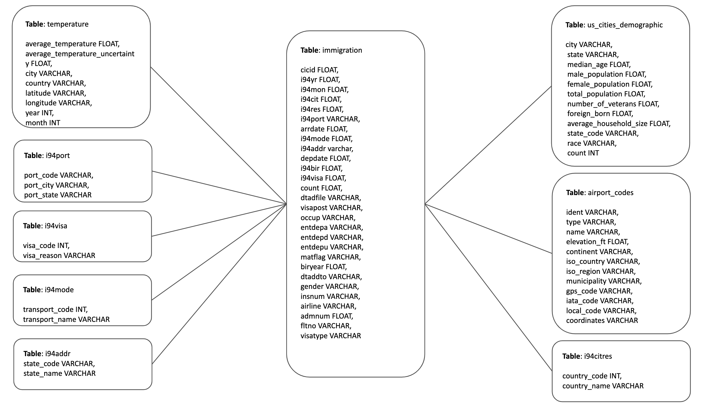
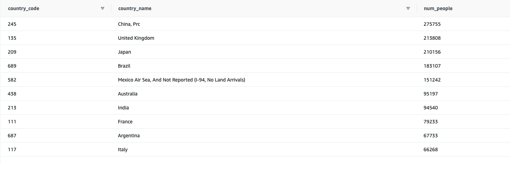
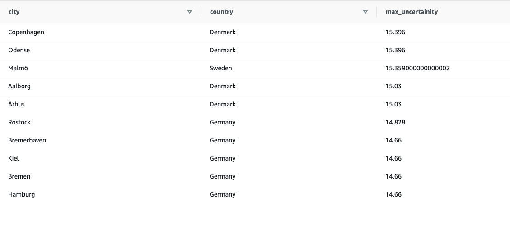
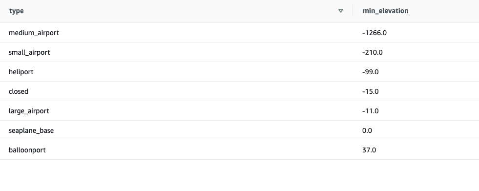
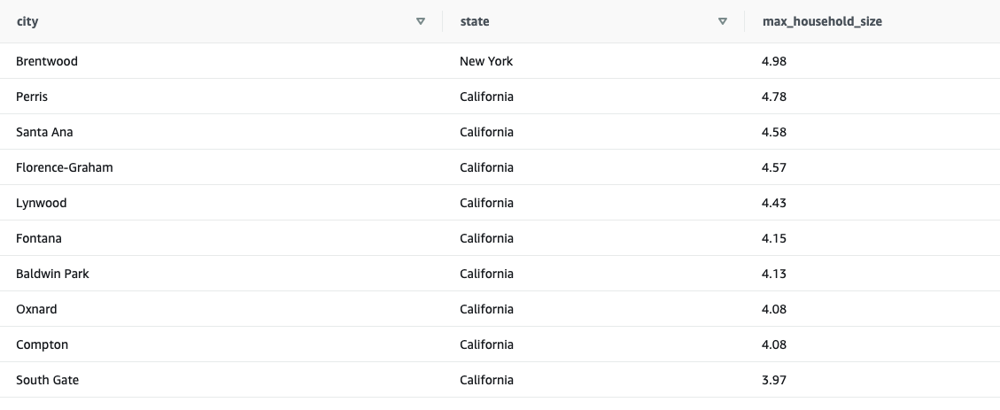

# Data Engineering Nanodegree Capstone Project 

This is a capstone project for the fulfilment of the requirements of Udacity Data Engineering Nanodegree program. This project is about using atleast three data engineering open source technologies to build an ETL pipeline. The motivation of the project is to be able to answer some application based questions from the data (Data Analaysis). The data were provided by Udacity on US Immigration. <br>

<b>NOTE:  Please refer to <i>write_up.pdf</i> file to follow the points asked in project rubric.</b>
## Introduction


 


The project is developed to build an ETL pipeline using Apache Airlow, PySpark, Amazon Redshift. The data were given in .csv, .SAS and .sas7bdat formats. It were first pre-processed, converted to fit to star schema and then used to answer the four application based questions(also given in a separate section). <b><i>For more details, please refer to <i>write_up.pdf</i> to know about the rationality behind the design decisions taken throughout this project and to find the answers to the points raised in project rubric. </i></b>

## Data Modelling

Above snapshot is followed to design the data modelling structure for the given project. immigration data is used as a fact table and the rest of the data are used as dimension tables.

## Technologies used
<div float="left">
  
   
  
</div>

## Application based Questions addressed in this project
We would like to address the following 4 questions: <br>
<b>Question 1</b>:question: From which country, maximum immigrants arrived to the US? <br>
<b>Question 2</b>:question: Which country/city has the maximum average temperature uncertainty? <br>
<b>Question 3</b>:question: Which type of airport has the least elevation feat? <br>
<b>Question 4</b>:question: Which city/state has the maximum average household size? <br>

## Project Structure
```bash
|____ airflow/              # contains the code for airflow
|____ aws/                  # contains the code for aws
|____ capstone_results/     # contains the snapshots of the query results direvctly from the redshift editor in AWS 
|____ img/                  # contains the images for the README.md
|____ raw_data/             # folder to contain all the raw data files
|____ pre_processed_csv/    # contains the pre-processed csv files
|____ pre_processed_parquet/ # contains the pre-processed parquet files
|____ data_dictionary.txt   # data dictionary file defining the column heares of all the data used along with the links of their source 
|____ dwh.cfg               # configuration file for aws- for starting the redhhift cluster
|____ write_up.pdf          # write up giving a detailed report regarding the project
|____ .gitignore
|____ README.md
```

I have created three folders: <i>raw_data</i>, <i>pre_processed_csv</i> and <i>pre_processed_parquet</i> to place the pre-processed data files into these folders. Then, the data is picked up from these folders to load into the s3 bucket called <i>'private-dend'</i>. 

## Airflow DAG


## Getting Started
Please follow the below steps in order: <br>
<b>STEP 1: </b> Go to the amazon management console and create s3 bucket in the name of 'private-dend'. Alternatively, you can choose any other name also. <br>
<b>STEP 2: </b> Go to the Udacity's Airflow console and copy the entire project.</br>
<b>STEP 3: </b> Copy all your raw data files in raw_data/ folder. </br>
<b>STEP 4: </b> Create your iam-role and Redshift cluster </br>
```
$ python aws/aws_starter.py --action create
``` 
The output will be \<iam-role> and \<reshift-cluster-end-point>. Copy it and save it somewhere in your system. <br>
<b>STEP 5: </b> Establish the following Variables in Airflow UI.


| Variable | Value  |
| :---   | :- |
| us_cities_demograph            |  /home/workspace/raw_data/us-cities-demographics.csv | | csv
| pre_processed_csv               |  /home/workspace/pre_processed_csv/ |
| airport_codes                    |       /home/workspace/raw_data/airport-codes_csv. csv |
| temperature                       |      /home/workspace/raw_data/GlobalLandTemperaturesByCity.csv   |
| sas_file                                |      /home/workspace/raw_data/I94_SAS_Labels_Descriptions.SAS |
| sas7bdat_file                    |        /home/workspace/raw_data/sas7bdat/ |
| pre_processed_parquet          | /home/workspace/pre_processed_parquet/ |
| s3_bucket                        |         private_dend |
| s3_prefix                        |           data-pipelines |
| iam_role   | iam-role |

<b>STEP 6: </b> Establish the following connections by clicking the Admin Tab in Airflow UI: <br>
<b>AWS Connection: </b>
| Field name | Value |
| :---   | :- |
| Conn_Id | Amazon Web Services |
| Login | AWS Access Key Id |
| Password | Secret Key Id |

- Click on Save button.

<b>Redshift: </b>
| Field name | Value |
| :---   | :- |
| Conn_Id | redshift |
| Host | Redshift cluster endpoint |
| Schema | dev |
| Login | username given in your dwh.cfg file |
| Password | password given in your dwh.cfg file |
| Port | 5439 this is also given in your dwh.cfg file |
- Click on Save button.

<b>STEP 7: </b> In your airflow workspace of udacity, execute the following command:
```
$ /opt/airflow/start.sh
```
Once executed click on the Airflow tab. </br>
<b>STEP 8: </b> Trigger your DAG and monitor in Airflow's UI. <br>
<b>STEP 9: </b> Once the execution of DAG is completed, execute the following command in the workspace to close your cluster.
```
$ python aws/aws_starter --action delete
```
This command will delete the cluster to avoid any further billing.<br>
<b>STEP 10: </b> Manually empty and delete your s3 bucket by going to the amazon management console to avoid further billing.


## Results

The data pipeline has been successfully executed. Below are the answers to the 4 application based questions we asked initially: <br>

<b>Question 1</b>:question: From which country, maximum immigrants arrived to the US? <br>


<b>Question 2</b>:question: Which country/city has the maximum average temperature uncertainty? <br>

<b>Question 3</b>:question: Which type of airport has the least elevation feat? <br>

<b>Question 4</b>:question: Which city/state has the maximum average household size? <br>


<br>
<b>Note: </b> Please refer to write_up.pdf for query statements used to fetch the results. 
## Author
* **Rupali Sinha** - *Initial work*

